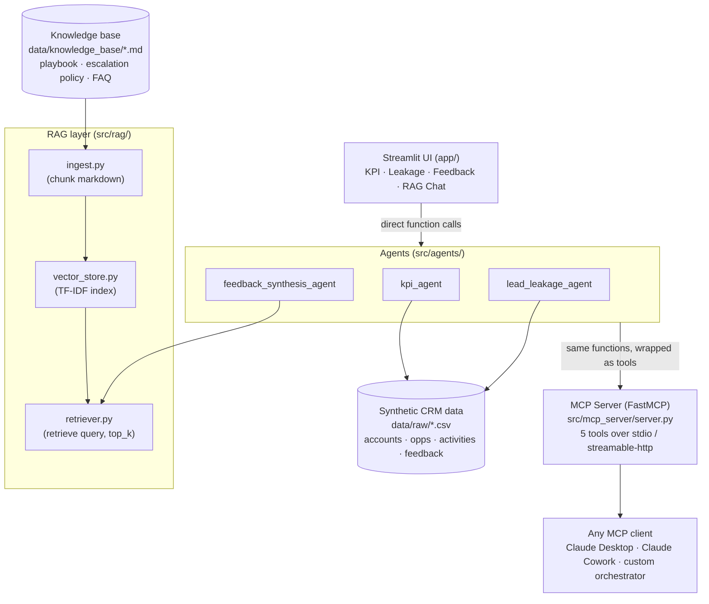

# Architecture

## Overview
A single coherent system demonstrating the JD's core AI/Copilot pillars end to end:
agent design, RAG grounding, structured JSON configuration, and MCP tool exposure —
applied to a Sales Ops / Client Services Ops problem space (the same functional
scope as the role itself).

## Design decisions worth defending in an interview

**Why TF-IDF instead of embeddings for RAG?**
The knowledge base is 3 short policy docs. TF-IDF is instant, needs no API key
or model download, and is fully explainable (you can point to the exact terms
driving a match). The `retriever.py` interface is written so swapping in real
embeddings (Voyage, OpenAI, local sentence-transformers) touches only
`vector_store.py` — nothing downstream changes. This is the right trade-off
call for a small, static knowledge base; a production system with thousands
of documents and paraphrase-heavy queries would need real embeddings.

**Why does the Streamlit app call agent functions directly instead of going
through the MCP server?**
Two consumption paths are intentional: (1) MCP exposes the same logic to any
MCP-compatible agent client — that's the "AI/Copilot Implementation" story;
(2) the Streamlit app is the human-facing operational dashboard — that's the
"Business Operations" story. Both call the same `src/agents/` functions so
there's one source of truth, not two implementations to keep in sync.

**Why JSON Schema for agent config?**
Mirrors how Copilot Studio / other low-code agent builders define an agent
(instructions, tools, triggers, guardrails) — `agent_config_schema.json` is
written so a JSON file following it could plausibly be adapted into that tool,
which is the literal "author/correct JSON for agent configuration" JD bullet.

**Why guardrails in the schema (`max_tool_calls_per_run`,
`requires_human_approval_above_usd`)?**
Because a real deployment of this into Sales Ops needs human-in-the-loop
controls on anything touching deal value or client-facing actions — this
reflects governance thinking, not just a working demo.
